**Access our slides here**: [link to the slides](https://docs.google.com/presentation/d/16T8LvSQ5uj9gnUBBecj8KH3wV3z4Z2RltOnnbTdN4Sw/edit?usp=sharing)

# Introduction

Learning controllable and interpretable generative model has been one of the main pursuit of image synthesis, yet the controllability and interpretability can happen at multiple faucets. Consider the examples in the figure below. If we want to generate these images, what is a reasonable way to generate them in a controllable fashion?

  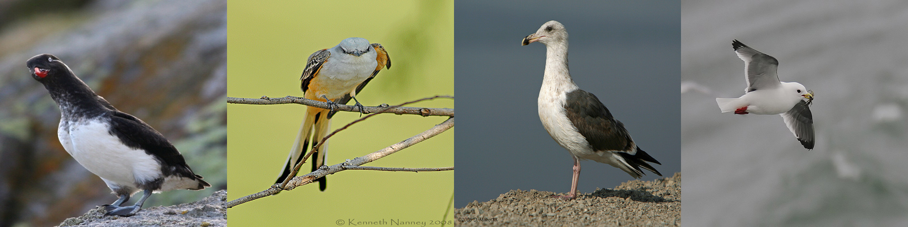

We believe at least one possible solution is to synthesize these images by object parts (e.g. the head, neck, belly, legs, wings of the bird and the background). Such an approach not only provides an explicit way to synthesize fine-grained details according to each specific object part, but also brings a controllability over the synthesis procedure via independently manipulation different parts of generated images.

On the other hand, Generative Adversarial Network (GAN) are tremendously successful for image generation. Current state-of-the-art methods along this direction are already able to generate photo-realistic images. By combining our idea with GANs, we could generate both photo-realistic and controllable images by object parts.

# Background

Let's first introduce the generative adversarial network (GAN). GAN is a class of machine learning framework invented by Ian Goodfellow and his colleagues in 2014. In a normal GAN, two neural networks contest with each other in a game, of which one is called generator and another one is called discriminator. The goal of the generator is to generate images of the same distribution with the images in the training set, and the goal of the discriminator is to distinguish the images generated by generator and the real images.

How does a Generator works? Assume a simple distribution of a latent code z, e.g. normal distribution of 100 dimensions. Under certain transformation, `f(z) = p(x)`, where `p(x)` is the data distribution we want to generate. `f` is modeled as a powerful convolutional neural network. See the figure below:

  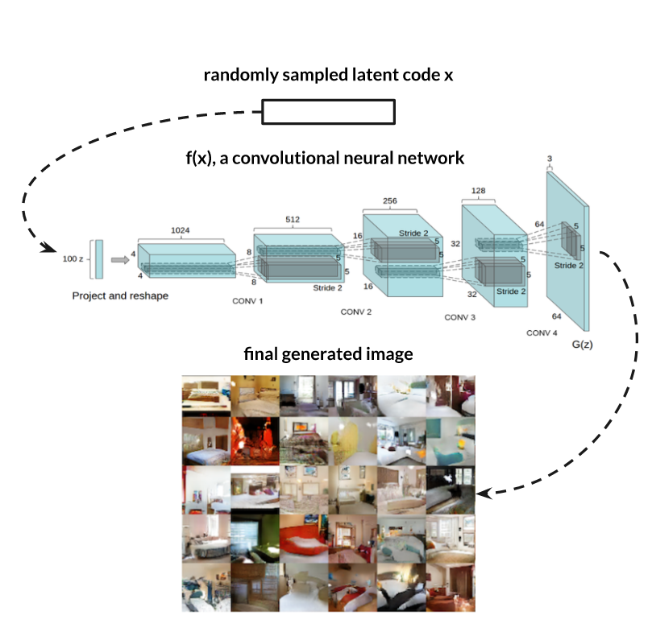

For discriminator in a deep convolutional GAN, it will also be a convolutional neural network, which maps an input image into a possibility of being fake or real.

In our project we use the structure of GAN. However, to the best of our knowledge, we do not think there are any papers sharing exactly the same idea of composing natural images via part representation with GAN. However, there exists many relevant works focusing on disentangling the generation process or providing interpretable results. For instance, Info-GAN proposed to learn more interpretable and controllable models by maximizing the lower bound of the mutual information between the latent code and the generated images. However, they did not model object parts explicitly, nor demonstrate any experimental results over relatively challenging datasets. Another closely related one is FineGAN, which proposed to model and object as a combination of background, foreground shape and background appearance. They also disentangled different factors by maximizing the mutual information similarly to Info-GAN. LR-GAN is also highly relevant, where they composed the image by recursively synthesizing and stitching background, foreground shape and transformation.

# Methods

## Method 1

### Intuition

How to generate images by parts? If we could build the dependency of the latent code and the output of the model, we could control the output by controlling different part of the latent code, and understanding the real-world meaning of the latent code better. Here is an example:

  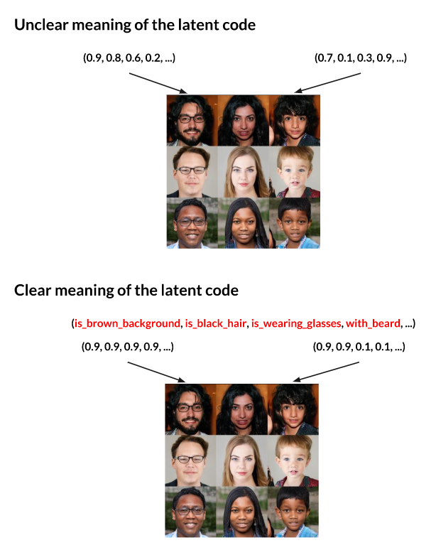

On the top, there is no clear relationship of the latent code and the generated image, or in other words, the meaning of the latent code is unclear. On the bottom, each dimension of the latent code has a clear meaning - the first dimension describes if the background is brown or not, the second dimension describes if the person has black hair or not, etc.. Therefore, ideally we could change the first dimension of the latent code to change the background when we synthesis the image, while keeping all other parts stable.

However, how could we achieve this? The first intuition is to directly spit the latent code into different parts, and use different parts to generate different parts of the image. To make things more clear, see the example below:

  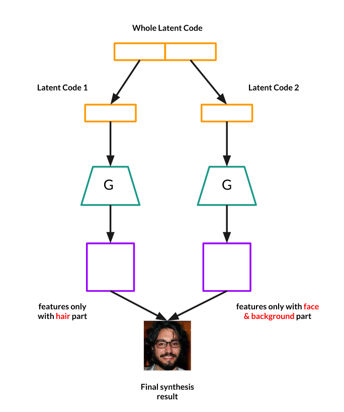

The whole input latent code sampled from a random distribution (for instance, Gaussian distribution with 100 dimensions) could be splitted into two parts, and each part is with 50 dimensions. One part of the latent code is used to generate features only with the hair part, and the other one will be used to generate features only with the face and the background part. Each part of the latent code will be used as the input of a generator `G`, and finally the features generated from different parts of the latent code will be used to syntheses the final output image.

However, our data is unlabelled, which means that we do not have labelled parts (or the semantic segmentation) of the training images. Therefore, we in our implementation we use attention maps with constraints to make the model learn how to distinguish different image parts by itself.

### Implementation

Here is the implementation of our idea. The figure below illustrated the structure of our network. For simplicity, assume we only split the latent code into two parts:

  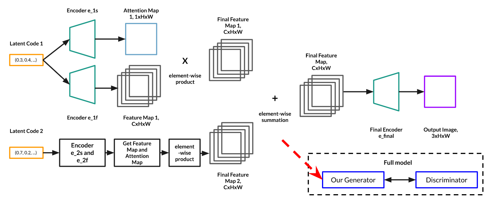

Firstly, the latent code is splitted into two parts as mentioned before, which are `Latent Code 1` and `Latent Code 2`. We will focus on `Latent Code 1` first. Both of these latent code are sampled from a simple random distribution like Gaussian distribution.

`Latent Code 1` will be used as the input of `Encoder e_1s` and `Encoder e_1f`. Both of the `Encoder e_1s` and `Encoder e_1f` are convolutional neural networks, however, their network structure are not the same with each other they do not share weights. The output of `Encoder e_1s` is an attention map, which is a `1xHxW` matrix; and the output of `Encoder e_1f` is the feature map, which is a `CxHxW` matrix in which `C` is the number of channels in the feature map. Then we will do an element-wise product of the attention map and each channel of the feature map to get the `Final Feature Map 1`, which is also a `CxHxW` matrix.

>  The reason of doing this element-wise product is that we could regard attention map as a part-based mask for the feature map. After the element-wise product only the part controlled by the current latent code will be kept in the final feature map. More details will be given in the next two sections.

The same process will be applied to `Latent Code 2` to get the `Final Feature Map 2`. Here `Encoder e_2s` and `Encoder e_2f` share the same network structure with `Encoder e_1s` and `Encoder e_1f`, but they do not share weights. After all `Final Feature Map #`  (Or in other words, `Final Feature Map 1` and `Final Feature Map 2`) are generated, all `Final Feature Map #` will be summed up to get the `Final Feature Map`.

  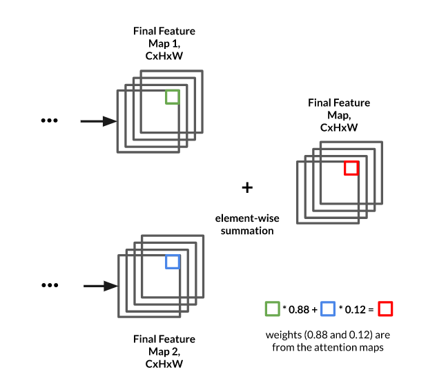

>Why all feature maps could be summed up? The reason of this is that we apply a Softmax function among all attention maps to make sure that for each pixel in the feature map, the summation of weights provided by the attention map is 1. Therefore the summation will not cause overflow. 
>
>Again, more details will be given in the next two sections.

Finally the `Final Feature Map` will be passed to the `Final Encoder e_final` to generate the final output image, which is a `3xHxW` image (for color images).

All the process above is talking about how to use the latent code to generate output images, which is actually the process of the `Our Generator`. There is also a `Discriminator` in our full model, which is also a convolutional neural network, but there is nothing special in the `Discriminator` - which is just the normal `Discriminator` used in DC-GAN. Finally the `Generator` and `Discriminator` will be trained in the traditional GAN training framework, which is trying to solve a minimax game.

#### Softmax for Attention Maps

Previously we mentioned that we could regard attention map as a part-based mask for the feature map, and ideally, for different latent code, their corresponding attention map will focus on different parts of the image. However, why different attention maps could learn different parts?

To achieve this we definitely need some constraints and regularizers. The first method we used is to apply Softmax function for different attention maps. See the figure below:

  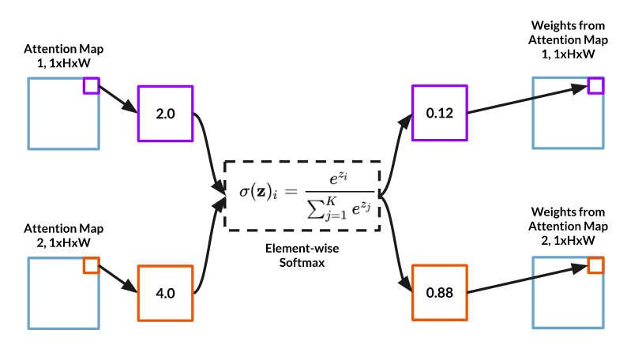

For the pixels at the same location in the attention map, a Softmax function will be applied on them to get the final weights (or the masks). After applying Softmax, the maximum value is converted to a number near one while other values will be close to zero. Therefore, each location in the attention maps tends to be exclusive and then every attention map can learn their own part.

And we will get a great property: After applying Softmax, the summation of weights from the same location in the final masks from attention map will be 1. Therefore, we could directly multiply the masks with the feature maps and sum all of the feature maps up.

#### Regularizers for Attention Maps

Only Softmax is not enough. Softmax will fail if the input is very close. Due to the random initialization, this can happen. We use additional regularizers as loss function to make different attention maps focus on different parts. After Softmax, the values of attention in the same location sums up to 1 and thus can be treated as a probabilistic distribution. Therefore, if we minimize the information entropy of all such distributions, the final attention map will be exclusive across all locations. The regularization term could be added to the final loss function.

## Method 2

### Intuition

Our method 2 is trying to solve this problem in a different angle and we get our intuition in different ways.

#### Bi-GAN

The intuition of our second method is mainly from Bi-GAN. Comparing with the traditional GAN structure, Bi-GAN used an encoder `E` to learn the mapping from the generated image to the latent code space. The structure of Bi-GAN is illustrated below:

  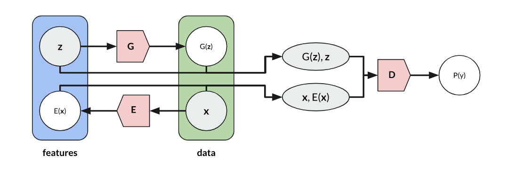

Both the image and the latent code will be used as the input for discriminator `D`. It means that `D` will need to distinguish the pair of `<latent_code, image>` is real or fake.

#### Region Grouping

Another intuition comes from a relevant paper [Zixuan Huang, CVPR' 20], which segments images into different object parts for classification. It learns a feature vector for each part in a weakly supervised fashion.

  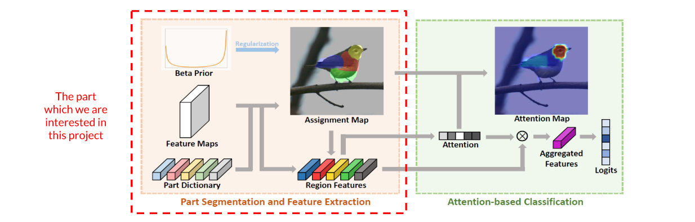

Generally, the pixels inside an image will be grouped into different region groups according to the part dictionary, and all part dictionary could be learned during the training process. For simplicity we won't too much details about this paper here. If you have interest, as this paper is accepted by CVPR 2020 as an oral paper, welcome to listen to the presentation at June online! 

#### Combine Two Ideas Together...

By combining the two intuitions we have our method. Bi-GAN recover the latent code from its generated image. So if we replace the encoder with the region grouping module, our new encoder will only generate part-based code. Bi-GAN will match the recovered code and the real code, thus our code for generation will also be part-based.

  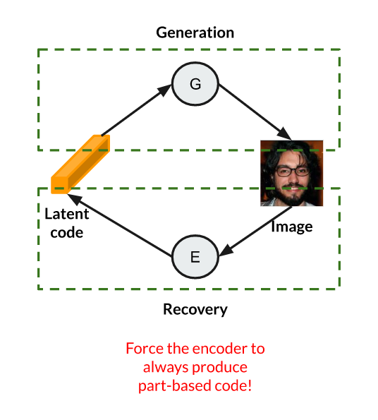

As our input latent-code is part-based, we could control the input latent code to control the parts in the final generated image.

### Implementation

Here is the implementation of our idea. The figure below illustrated the structure of our network:

  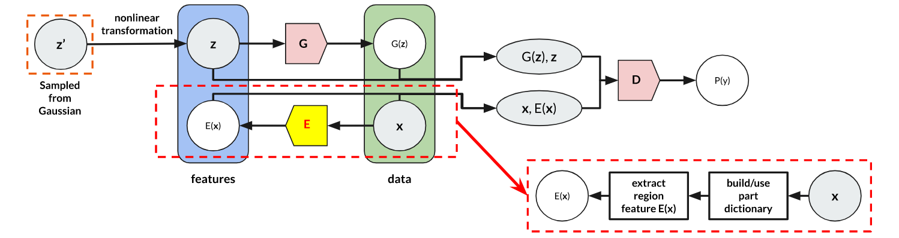

It basically shares the same structure with Bi-GAN, however we replace the encoder with the region grouping module mentioned before. During the encoding process, region features will be extracted from the image x based on a part dictionary learned from the data. Then we can match the latent code z with these region features.

As the distribution of the region features can not follow a Gaussian distribution, we added some extra layers in the training process to convert z' which is sampled from Gaussian to z, so ideally z and encoded feature E(x) can learn to share the same distribution. 

The rest of the training process and the structure of the network are identical with Bi-GAN.

# Experiments and Results

We do our experiments on dataset Celeba, which is a dataset of human faces.

## Method 1

## Method 2

# Conclusion

# References

